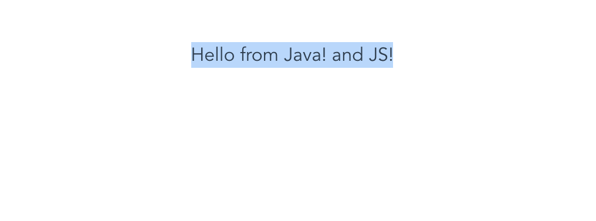

# j2cl_webpack_demo

## how this project is created?

1. this probject is created using `vue create j2cl_webpack_demo` 
2. the `helloworld.js` and `helloword.js` is copied from j2cl sample project with minor modification. [j2cl_export_symbol_demo](https://github.com/swuecho/j2cl_export_symbol_demo)

these two files are included in the git repo. (they are copied from bazel-bin/src folder after run `bazel build`)

3. after `yarn install` and `yarn serve`, the output in the sceen should be 'Hello from Java! and JS!'

